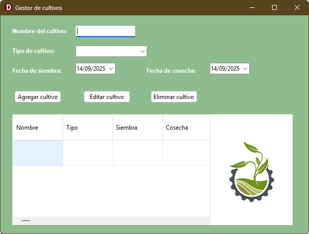
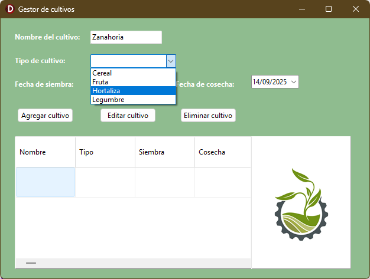
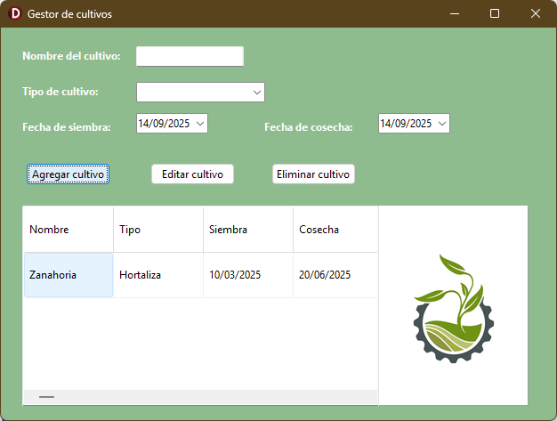
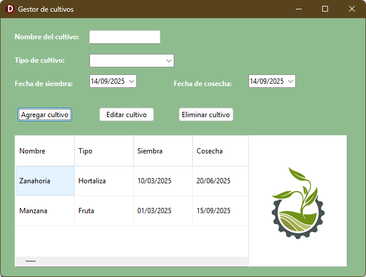

# Gestor de Cultivos 🌾

Interfaz de aplicación desarrollada en **Delphi** para registrar y administrar cultivos agrícolas.  

## ✨ Características
- Visualización de los cultivos en tablas. 
- Soporte para varios tipos de cultivo.

## 🛠️ Tecnologías
- Delphi VCL  
- Object Pascal  

## 📸 Capturas de pantalla

